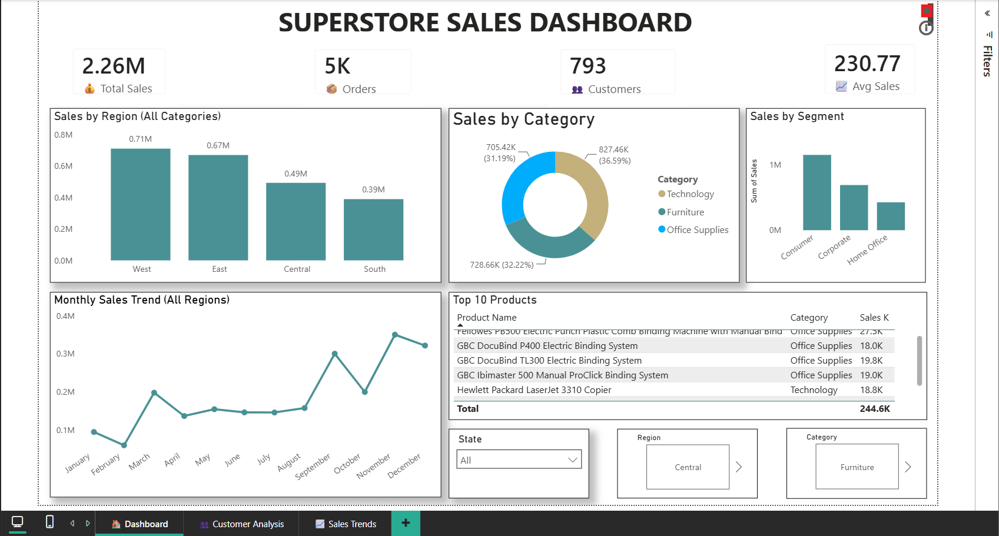
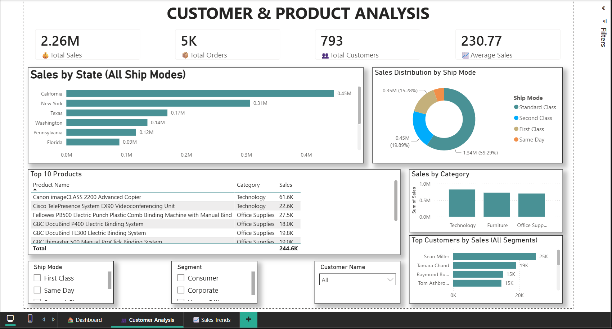
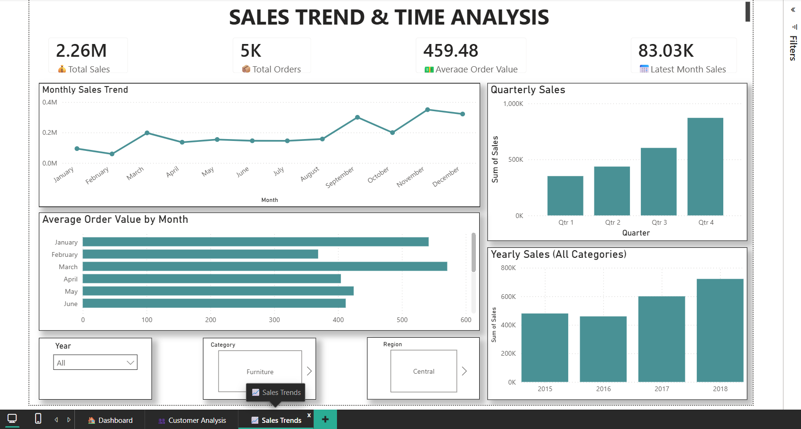

# 📊Superstore-PowerBI-Dashboard
An interactive **Power BI dashboard** built using the **Superstore Sales Dataset** to analyze sales performance, customer behavior, product insights, and time-based business trends.

---

## 📌 Project Overview

This dashboard helps users analyze:

- Total Sales
- Total Orders
- Total Customers
- Average Sales
- Average Order Value
- Latest Month Sales

The report includes interactive filters, DAX measures, bookmarks, and navigation for an enhanced user experience.

---

## 🚀 Features

- 📈 Executive Sales Dashboard
- 👥 Customer & Product Analysis
- 📅 Sales Trend & Time Analysis
- 📊 KPI Cards
- 🎯 Interactive Slicers
- 📌 Bookmarks & Information Popup
- 🔄 Cross Filtering
- 📐 Responsive Dashboard Layout

---

## 🛠️ Tools & Technologies

- Microsoft Power BI
- Power Query
- DAX (Data Analysis Expressions)

---

## 📂 Dashboard Pages

### 🏠 Dashboard

---

### 👥 Customer & Product Analysis

---

### 📈 Sales Trend & Time Analysis

---

## 📁 Files Included

- Superstore_Sales_Dashboard.pbix
- Superstore_Sales_Dashboard.pdf
- dashboard.png
- customer-analysis.png
- sales-trends.png
- train.csv (Dataset)

---

## 💡 Key Insights

- Region-wise Sales Analysis
- Category-wise Sales Distribution
- Segment Analysis
- Top Selling Products
- Top Customers
- Monthly Sales Trends
- Quarterly Sales Analysis
- Yearly Sales Performance

---

## 👨‍💻 Author

**Khemchand Prajapat**

📧 **Email:**  
**kpparjapat76@gmail.com**

💼 **LinkedIn:**  
https://www.linkedin.com/in/khemchand-prajapat-15935b28a

🌐 **GitHub:**  
https://github.com/KhemchandPrajapat
---

⭐ If you found this project useful, feel free to star this repository.
